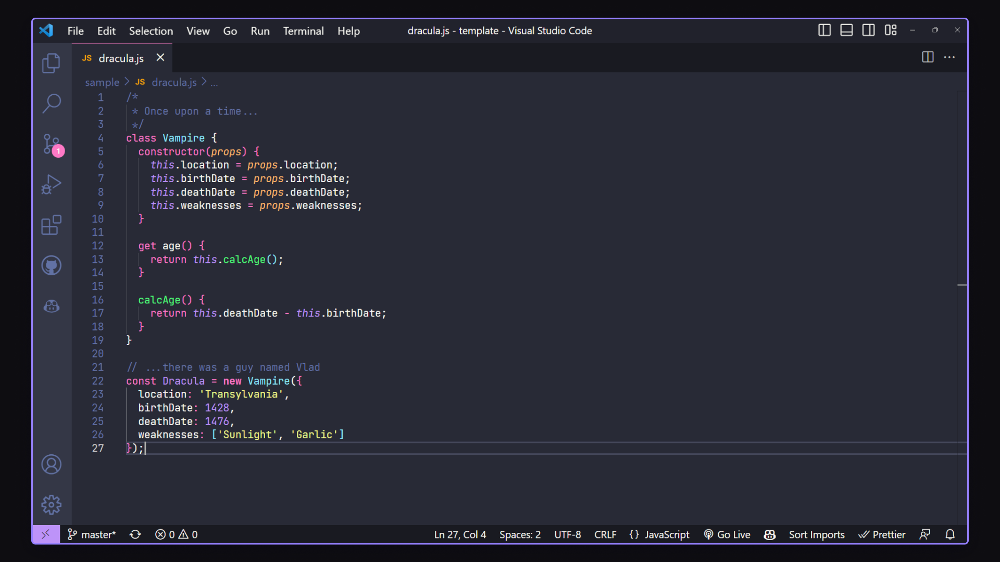

# Dracula for [Actual Budget](https://actualbudget.org)

> A dark theme for [Actual Budget](https://actualbudget.org).



## Install

1. In Actual, go to **Settings**.
2. Open **Appearance**.
3. Under **Custom themes**, install this GitHub repo:

```text
lelemm/dracula
```

## Team

This theme is maintained by the following person(s) and a bunch of [awesome contributors](https://github.com/lelemm/dracula/graphs/contributors).

| [](https://github.com/lelemm) |
| ----------------------------------------------------------------------------- |
| [lelemm](https://github.com/lelemm)                                           |

## Community

- [Twitter](https://twitter.com/draculatheme) - Best for getting updates about themes and new stuff.
- [GitHub](https://github.com/dracula/dracula-theme/discussions) - Best for asking questions and discussing issues.
- [Discord](https://draculatheme.com/discord-invite) - Best for hanging out with the community.

## Dracula PRO

[](https://draculatheme.com/pro)

## License

[MIT License](./LICENSE)
